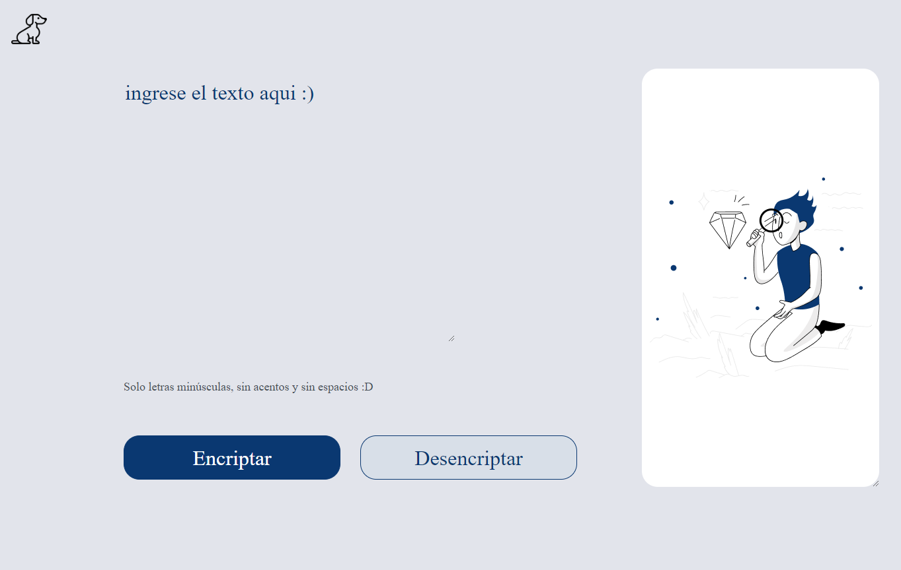

# Alura-ONE_challenge-encriptador
challengeonecodificador5

Este proyecto es parte de un curso de Alura y Oracle Next Education

Cómo funciona:
Encriptar. Dada una entrada de texto se puede obtener una versión simplemente encriptada de la misma, la que puede ser copiada en el portapapeles. 
Desencriptar. Se puede pegar cualquier texto previamente encriptado y volverlo a su estado inical.

Llaves de encriptacion
La letra "e" es convertida para "enter"
La letra "i" es convertida para "imes"
La letra "a" es convertida para "ai"
La letra "o" es convertida para "ober"
La letra "u" es convertida para "ufat"
